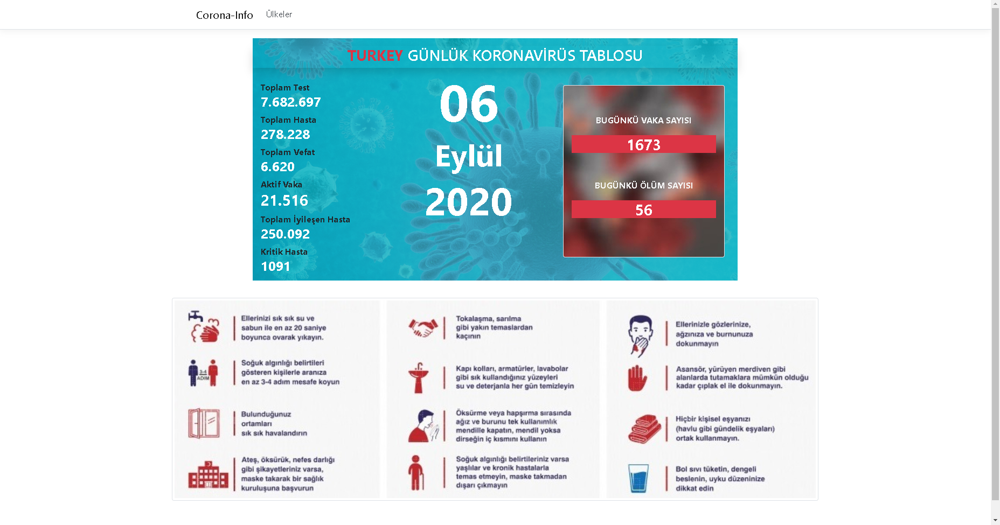
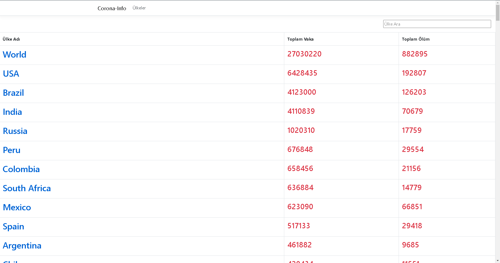

# CoronaCase-

Asp.Net core mvc - Json - Http

<h4> Mvc application that connects to the API and pulls the data </h4>

API = https://coronavirus-19-api.herokuapp.com/  
API GITHUB = https://github.com/javieraviles/covidAPI

